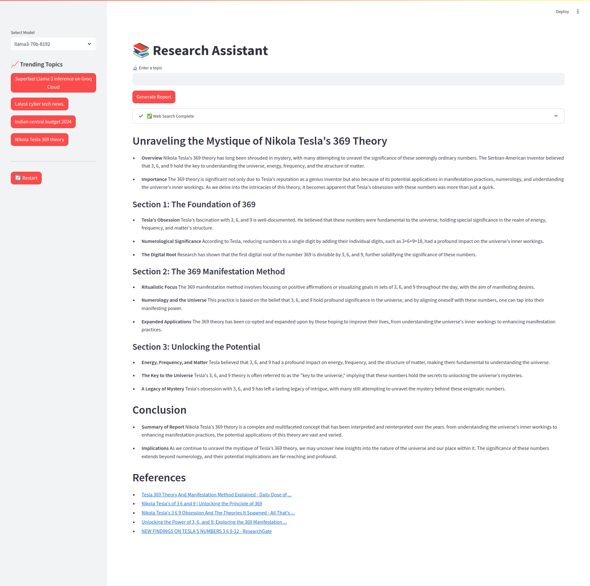

# Research Assistant Web App

This is a **Streamlit** application that acts as a research assistant, leveraging **Groq Cloud LLM models** and **TavilyTools** for generating high-quality, New York Times-worthy reports on various topics.


## Screenshots

### Main Interface



## Features

- **LLM Model Selection**: Choose from multiple models, such as `llama3-70b-8192`, `llama3-8b-8192`, and `mixtral-8x7b-32768`.
- **Dynamic Report Generation**: Generate a detailed report by entering a topic.
- **Trending Topics**: Access pre-defined trending topics from the sidebar for quick analysis.
- **Web Search Integration**: Use **TavilyTools** to fetch relevant information from the web.
- **Responsive Sidebar**: Restart the app or switch models seamlessly.

## Setup and Installation

1. Clone the repository:
   ```bash
   git clone <repository_url>
   cd <repository_directory>
